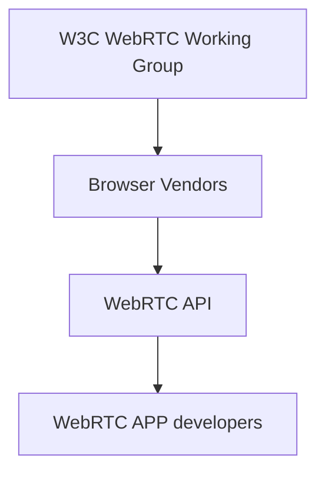
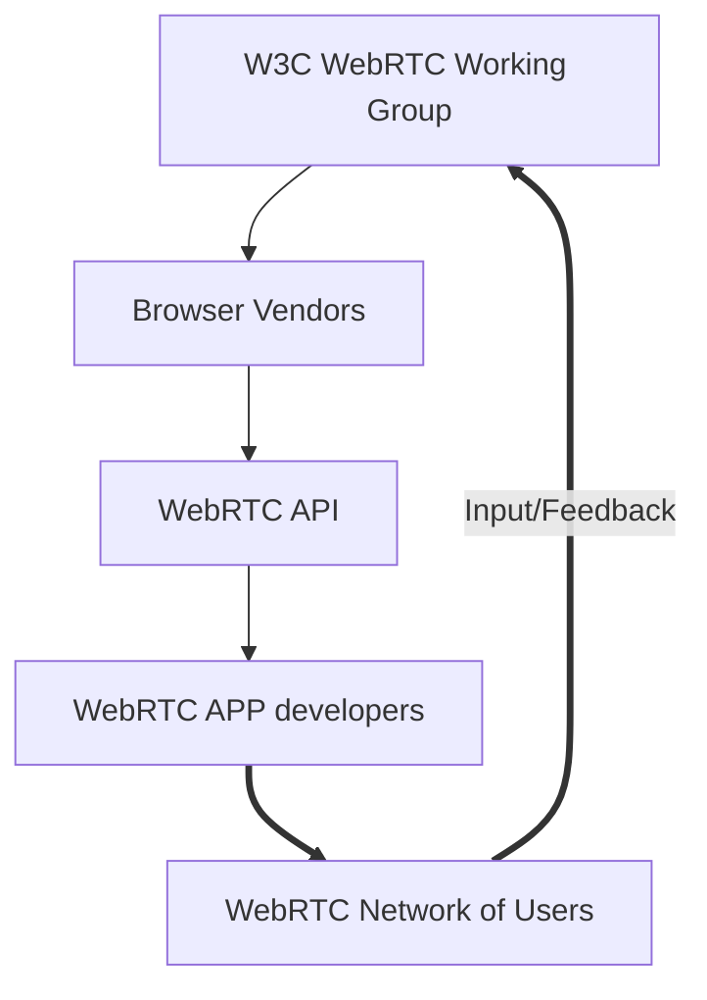

# WebRTC Network of Users.
## A loose grouping of WebRTC developers who give input/feedback to the w3c WebRTC working group.

### Current waterfall model for standards development

### Add webrtc.nu to provide input/feedback

### Background
This is based on a discussion had at TPAC 2022
see https://www.w3.org/2022/09/12-webrtc-minutes.html#t04 

The core thesis is that the W3C process isn't matching developer expectations so they dont't contribute
feedback or ideas. 

The idea is for https://webrtc.nu to be an impedence matching interface between developers consuming the webRTC APIs and the W3C working group that specifies them.

### How will this work?
TBD, but we definitely want to see an active open community form around this project - we aspire to the welcoming nature of https://pion.ly
We think that contributions/meetings should be held under Chatham House rules (or something similar) 

### Some ideas
- do a survey via the existing local WebRTC developer groups that exist world wide to help the W3C WG get a better handle on developer feeling.
  (what questions should we ask?)
- facilitate a virtual quaterly meetup where people discuss webRTC API issues in a Bof style, with summaries fed back to the W3C WG
- organize a physical meetup on the side of an existing webRTC related conference or event, with hot button topics fed back to the W3C WG

### What can you do to help?
- tell me how to get markdown to render the pretty diagrams on github pages!
- file PRs to improve this site
- become an admin for this github organization
- comment on the ideas above
- add new ideas 
- contact me for an off the record informal chat 

<!-- code to render the diagrams above on the client side please retain or replace with something better --->

